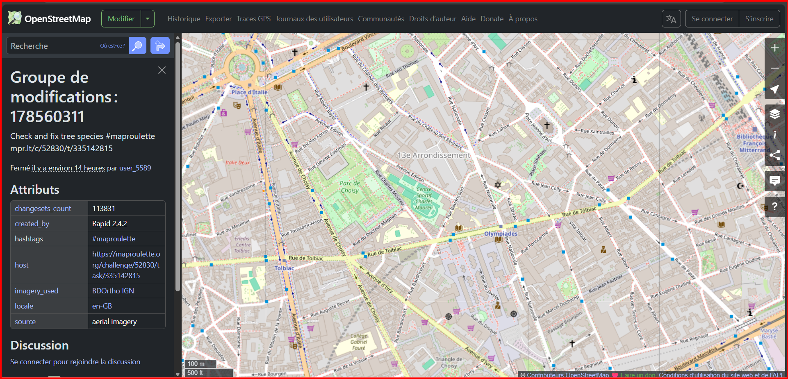

# DOSSIER DE CONFIGURATION D'EXPLOITATION (DCE)
## 🌍 PROJET GEOLOCALISATION IP V1.0



> **Document destiné à l'équipe technique et aux recruteurs**
>
> **Version:** 1.0.0 Stable  
> **Date de Release:** 15 Février 2026  
> **Auteur:** KAMENI TCHOUATCHEU GAETAN BRUNEL (Ingénieur Logiciel)  
> **Contact:** [gaetanbrunel.kamenitchouatcheu@et.esiea.fr](mailto:gaetanbrunel.kamenitchouatcheu@et.esiea.fr)

---

## 📑 TABLE DES MATIÈRES

1.  [Contexte et Objectifs](#1-contexte-et-objectifs)
2.  [Architecture Technique](#2-architecture-technique)
3.  [Stack Technologique](#3-stack-technologique)
4.  [Fonctionnalités Clés](#4-fonctionnalités-clés)
5.  [Procédure d'Installation](#5-procédure-dinstallation)
6.  [Guide d'Utilisation](#6-guide-dutilisation)
7.  [Qualité Code & Bestmap](#7-qualité-code--bestmap)

---

## 1. CONTEXTE ET OBJECTIFS

Ce projet a été conçu pour démontrer la mise en œuvre d'une architecture orientée services (SOA) moderne et robuste. L'objectif principal est de fournir un outil de géolocalisation IP précis, intégrant des données tierces via API REST et offrant une visualisation cartographique instantanée.

### Pourquoi ce projet ?
-   **Microservices Pattern:** Découplage clair entre le Backend (FastAPI) et le Frontend (NiceGUI).
-   **Reliability:** Gestion avancée des erreurs API et des timeouts.
-   **Clean Code:** Respect strict des standards Python (Type Hinting, PEP8).
-   **User Experience:** Interface réactive sans rechargement de page.

---

## 2. ARCHITECTURE TECHNIQUE

Le système repose sur une communication client-serveur asynchrone optimisée.

```mermaid
graph LR
    User((Utilisateur)) -->|Interaction| UI[Frontend NiceGUI]
    UI -->|HTTP GET /ip/{ip}| API[Backend FastAPI]
    API -->|Validation & Cache| Service[Service Geolocalisation]
    Service -->|HTTPS Call| External[CIRCL.LU API]
    External -->|JSON Data| Service
    Service -->|Data Normalized| UI
    UI -->|Open Map| OSM[OpenStreetMap]
```

### Flux de Données
1.  **Requête:** L'utilisateur saisit une IP.
2.  **Traitement:** Le Backend valide la requête, interroge l'API externe (CIRCL) avec un timeout strict de 10s.
3.  **Réponse:** Les données brutes sont normalisées (JSON standardisé) et renvoyées au Frontend.
4.  **Visualisation:** Le Frontend met à jour l'IHM et déclenche l'ouverture de la carte centrée sur les coordonnées GPS.

---

## 3. STACK TECHNOLOGIQUE

Choix techniques basés sur la performance et la maintenabilité.

| Composant | Technologie | Version | Justification |
| :--- | :--- | :--- | :--- |
| **Langage** | Python | 3.12+ | Typage fort, Ecosystème riche |
| **Backend** | FastAPI | 0.109+ | Performance (Starlette), Validation (Pydantic), Documentation Auto. |
| **Frontend** | NiceGUI | 1.4+ | Développement rapide d'UI web native en Python |
| **API Client** | Requests | 2.31+ | Standard robuste pour les appels HTTP |
| **Serveur** | Uvicorn | 0.22+ | Serveur ASGI haute performance |
| **Gestion Dep.** | Poetry | 1.0+ | Gestion déterministe des dépendances et environnements |

---

## 4. FONCTIONNALITÉS CLÉS

### 🚀 Core Features
-   **Géolocalisation Précise:** Récupération des données pays, ville, latitude, longitude, ASN et Timezone.
-   **Visualisation Cartographique:** Intégration fluide avec OpenStreetMap.
-   **Configuration Dynamique:** Architecture adaptable via variables d'environnement (.env).

### 🛡️ Sécurité & Robustesse
-   **Validation des Entrées:** Vérification stricte des formats IP.
-   **Gestion des Erreurs:** Feedback utilisateur clair en cas de panne réseau ou API indisponible.
-   **CORS Configuré:** Sécurisation des accès cross-origin.

---

## 5. PROCÉDURE D'INSTALLATION

### Prérequis
-   Python 3.12 installé
-   Git installé
-   Poetry (recommandé) ou Pip

### Installation Rapide

```bash
# 1. Cloner le dépôt
git clone https://github.com/votre-username/geoloc-ip-service.git
cd geoloc-ip-service

# 2. Installer les dépendances via Poetry
poetry install

# 3. Activer l'environnement virtuel
poetry shell
```

---

## 6. GUIDE D'UTILISATION

L'application nécessite deux terminaux pour simuler l'architecture microservices.

### Étape 1 : Démarrer l'API Backend
Dans un premier terminal :
```bash
poetry run uvicorn webserv:app --reload
```
✅ *Le serveur écoute sur http://127.0.0.1:8000*

### Étape 2 : Démarrer l'Interface Client
Dans un second terminal :
```bash
poetry run python client.py
```
🚀 *L'interface web s'ouvre automatiquement dans votre navigateur par défaut.*

### Test Rapide
1.  Entrez l'IP `8.8.8.8` (Google DNS).
2.  Cliquez sur **"Geolocate IP"**.
3.  Observez les résultats détaillés et la carte qui s'ouvre.

---

## 7. QUALITÉ CODE & BESTMAP

Le projet suit les principes du **Clean Code** :
-   **Docstrings:** Documentation complète des modules, classes et fonctions.
-   **Type Hints:** Utilisation extensive de `typing` pour la robustesse.
-   **Settings Management:** Utilisation de Pydantic Settings pour la gestion de la configuration.
-   **Modularité:** Séparation stricte des responsabilités (Single Responsibility Principle).

---

> *"L'excellence n'est pas un acte, mais une habitude."*
> 
> *Ce projet démontre ma capacité à concevoir des architectures logicielles complètes, testables et maintenables.*

---
© 2026 Kameni Tchouatcheu Gaetan Brunel - Tous droits réservés.
